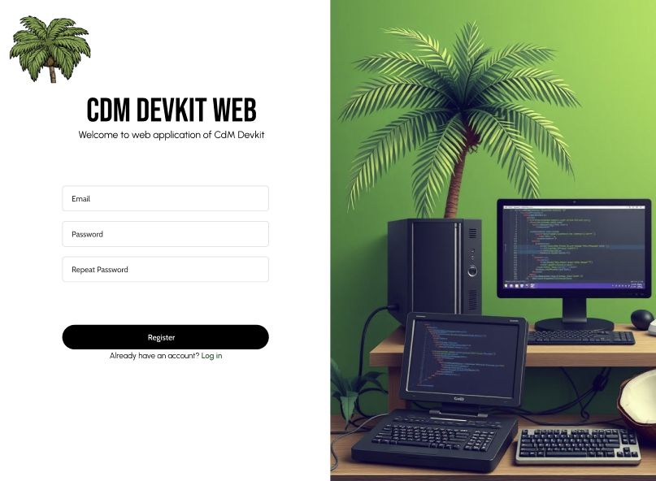
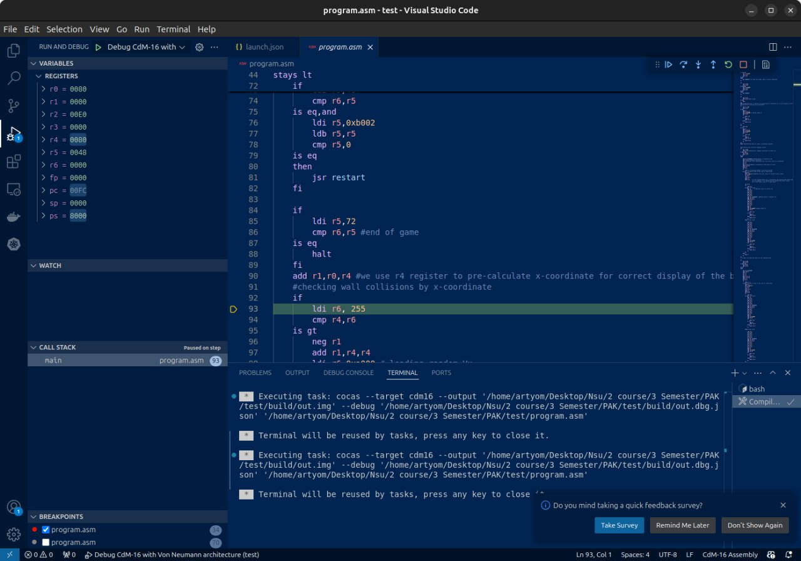

# cdm-devkit-web
A web application providing remote development for CdM processors with [cdm-devkit extension for VSCode](https://github.com/cdm-processors/cdm-devkit/tree/master)

## Project structure

```bash
cdm-devkit-web
    ├── README.md
    ├── .env
    ├── cdm-web
    │   ├── Dockerfile
    │   ├── build.gradle
    │   ├── dev-readme.md
    │   ├── gradle
    │   │   └── wrapper
    │   │       ├── gradle-wrapper.jar
    │   │       └── gradle-wrapper.properties
    │   ├── gradlew
    │   ├── gradlew.bat
    │   ├── settings.gradle
    │   └── src
    │       ├── main
    │       │   ├── java
    │       │   │   └── org
    │       │   │       └── cdm
    │       │   │           └── web
    │       │   │               └── backend
    │       │   │                   ├── CdmWebApplication.java
    │       │   │                   ├── config
    │       │   │                   │   └── WebConfig.java
    │       │   │                   ├── controller
    │       │   │                   │   ├── AdminController.java
    │       │   │                   │   ├── AuthController.java
    │       │   │                   │   ├── DockerController.java
    │       │   │                   │   ├── HeartbeatController.java
    │       │   │                   │   └── RegistrationController.java
    │       │   │                   ├── docker
    │       │   │                   │   ├── DockerConfig.java
    │       │   │                   │   ├── DockerService.java
    │       │   │                   │   └── SchedulerConfig.java
    │       │   │                   ├── email
    │       │   │                   │   ├── EmailService.java
    │       │   │                   │   ├── EmailServiceImpl.java
    │       │   │                   │   ├── OnRegistrationCompleteEvent.java
    │       │   │                   │   ├── RegistrationListener.java
    │       │   │                   │   ├── VerificationToken.java
    │       │   │                   │   └── VerificationTokenRepository.java
    │       │   │                   ├── model
    │       │   │                   │   └── ContainerResponse.java
    │       │   │                   ├── mvc
    │       │   │                   │   └── MvcConfig.java
    │       │   │                   ├── role
    │       │   │                   │   ├── Role.java
    │       │   │                   │   └── RoleRepository.java
    │       │   │                   ├── security
    │       │   │                   │   ├── CustomAuthenticationFailureHandler.java
    │       │   │                   │   └── WebSecurityConfig.java
    │       │   │                   └── user
    │       │   │                       ├── User.java
    │       │   │                       ├── UserRepository.java
    │       │   │                       └── UserService.java
    │       │   └── resources
    │       │       ├── application.properties
    │       │       ├── messages.properties
    │       │       └── templates
    │       │           ├── admin.html
    │       │           ├── badUser.html
    │       │           ├── index.html
    │       │           ├── login.html
    │       │           └── registration.html
    │       └── test
    │           ├── java
    │           │   └── org
    │           │       └── cdm
    │           │           └── web
    │           │               └── backend
    │           │                   ├── CdmWebApplicationTests.java
    │           │                   ├── E2ETest.java
    │           │                   ├── IntegrateTest.java
    │           │                   └── UnitTest.java
    │           └── resources
    |               ├── .env
    │               └── compose.yaml
    ├── docker-compose.yaml
    ├── docker-directory
    │   ├── Dockerfile
    │   ├── config.yaml
    │   └── docker-compose.yaml
    ├── migrations
    │   ├── 001_add_roles.sql
    │   └── Dockerfile
    └── website-directory
        ├── Dockerfile
        ├── README.md
        ├── package-lock.json
        ├── package.json
        ├── public
        │   ├── favicon.svg
        │   ├── index.html
        │   ├── manifest.json
        │   └── robots.txt
        ├── src
        │   ├── App.js
        │   ├── assets
        │   │   ├── background.jpg
        │   │   ├── logo.png
        │   │   ├── newback.png
        │   │   ├── newback1.png
        │   │   └── newback2.jpg
        │   ├── auth
        │   │   ├── actions
        │   │   │   └── userActions.js
        │   │   ├── reducers
        │   │   │   ├── rootReducer.js
        │   │   │   └── sessionReducer.js
        │   │   └── store.js
        │   ├── components
        │   │   ├── FormLib.js
        │   │   └── Style.js
        │   ├── index.css
        │   ├── index.js
        │   ├── pages
        │   │   ├── Dashboard.js
        │   │   ├── Home.js
        │   │   ├── Login.js
        │   │   └── Signup.js
        │   └── store
        │       └── store.js
        └── yarn.lock
```

## System requirements
You need docker to be installed on server side to run the application.

**IMPORTANT**: all of deployment actions must be done as **root user**

**IMPORTANT #2**: check closely for **.env** files' locations

## How to run application

In the root folder, run `docker compose up ` (with `--build`, if you haven't build anything yet)

## Deploy process

There is 4 different services in `docker-compose.yaml` that wrap up in containers: backend, frontend, database and migrations in database. All of them depend from each other in a way: database -> migrations -> backend -> frontend.

## Test running

To run tests, execute this commands as the root
```bash
cd cdm-web
./gradlew test
```

## User guide

To use cdm-devkit-web application as user, you have to:
    
1. Login or register
    * If you haven't registered yet, you will get a confirmation mail
2. Press *"create container"* button
3. After creating the container, press *"go"* button
4. You will be redirected to VSCode web container with setted up environment

Sign up page example:


CdM-16 emulator debug example:


You can find guide for using cdm-devkit extension in [corresponding repository](https://github.com/cdm-processors/cdm-devkit/tree/master).
